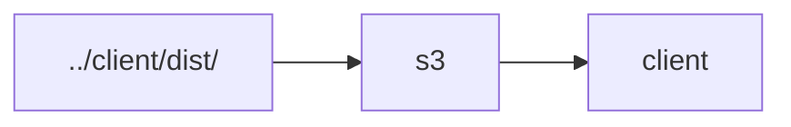
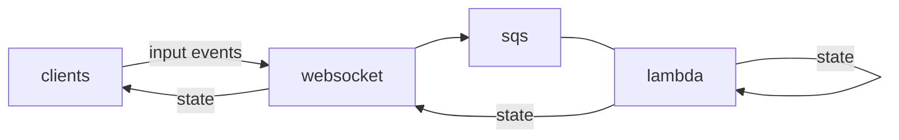

# service

## package scripts

### `yarn cdk`

For more information on the `cdk` command, consult the [AWS CDK CLI reference materials](https://docs.aws.amazon.com/cdk/latest/guide/cli.html).

## static site

The `../client/dist/` directory is published to an S3 bucket that is hosted via CloudFront and Route53 at https://www.darkforest.click.

## multiplayer

Clients publish input events to a WebSocket API. Input events are relayed from the API to an SQS queue. A Lambda function reads the messages from the queue and evaluates a new game state, which it publishes to the API before recursing upon itself.

## reference

- https://github.com/aws-samples/aws-cdk-examples/tree/master/typescript
