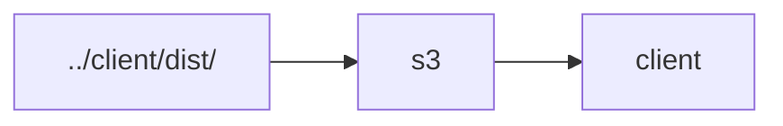
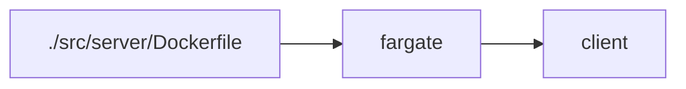

# service

## package scripts

### `yarn cdk`

For more information on the `cdk` command, consult the [AWS CDK CLI reference materials](https://docs.aws.amazon.com/cdk/latest/guide/cli.html).

## static site

The `../client/dist/` directory is published to an S3 bucket that is hosted via CloudFront and Route53 at https://www.darkforest.click.

## websocket server

The `Dockerfile` in `./src/server` is published to Fargate and exposed to the internet via CloudFront and Route53 at https://api.darkforest.click.

## reference

- https://github.com/aws-samples/aws-cdk-examples/tree/master/typescript
- https://edwinradtke.com/eventtargets
- https://github.com/aws-samples/aws-cdk-examples/tree/master/typescript/lambda-cron
- https://github.com/aws-samples/aws-cdk-examples/tree/master/typescript/api-websocket-lambda-dynamodb
- https://docs.aws.amazon.com/cdk/api/latest/docs/@aws-cdk_aws-sqs.Queue.html
- https://github.com/mozilla/BrowserQuest
- http://shajisethu.blogspot.com/2006/01/chatty-or-chunky-interfaces.html
- https://www.npmjs.com/package/ws
- https://blog.jeffbryner.com/2020/07/20/aws-cdk-docker-explorations.html
- https://github.com/lrutten/docker-nodejs-ws
- https://www.giacomovacca.com/2015/01/dockerize-nodejs-websocket-server-in-5.html
- https://techholding.co/blog/aws-websocket-alb-ecs/
- https://docs.docker.com/get-started/02_our_app/
- https://github.com/aws-samples/aws-cdk-examples/tree/master/typescript/ecs/fargate-service-with-local-image
- https://medium.com/containers-on-aws/building-a-socket-io-chat-app-and-deploying-it-using-aws-fargate-86fd7cbce13f
- https://stackoverflow.com/questions/67361936/exec-user-process-caused-exec-format-error-in-aws-fargate-service
- https://github.com/aws/aws-cdk/issues/12472
- https://github.com/aws/aws-cdk/issues/12472
- https://stackoverflow.com/questions/44770254/ecs-service-other-than-http-keeps-restarting
- https://stackoverflow.com/questions/45213473/aws-alb-health-check-pass-http-but-not-websocket
- https://stackoverflow.com/questions/39336033/does-an-application-load-balancer-support-websockets
- https://aws.amazon.com/premiumsupport/knowledge-center/elb-fix-failing-health-checks-alb/#:~:text=Success%20codes%20are%20the%20HTTP,that%20it's%20expecting%20to%20receive.
- https://github.com/nathanpeck/socket.io-chat-fargate
- https://stackoverflow.com/questions/48720949/secure-web-socket-wss-using-aws-load-balancer
- https://cloudonaut.io/ecs-vs-fargate-whats-the-difference/
- https://docs.aws.amazon.com/AmazonECS/latest/developerguide/task_definitions.html
